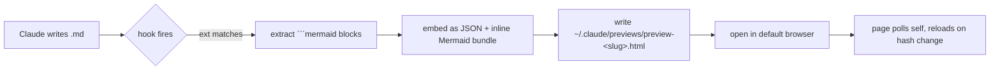

# mermaid-preview

Auto-preview Mermaid diagrams in the browser whenever Claude Code writes to a markdown-ish file.

- **Offline-safe.** Mermaid bundle (`@11.4.1`) is vendored and inlined into each preview HTML, so no network call is ever made at render time.
- **Dark-mode aware.** Both the page chrome and the Mermaid theme follow `prefers-color-scheme`.
- **Auto-reload without scroll loss.** Each preview polls its own content hash and reloads only when the source changes.
- **Per-file previews.** Every source file gets its own preview HTML keyed by a path hash; previews for different files coexist instead of clobbering each other.
- **Injection-safe.** Diagram source is passed to the page as a JSON array and applied via `textContent`; `</script>` literals inside the bundle are pre-escaped.

## Install

```
/plugin install mermaid-preview@xiaolai
```

> **Install fails with "Plugin not found in marketplace 'xiaolai'"?** Your local marketplace clone is stale. Run `claude plugin marketplace update xiaolai` and retry — `plugin install` does not auto-refresh.

No further configuration needed. The plugin registers a `PostToolUse` hook on `Write|Edit|MultiEdit|NotebookEdit` and writes previews to `~/.claude/previews/`.

## How it works



1. Hook reads the tool payload, extracts the edited file path.
2. Exits silently unless the extension is `.md`, `.mmd`, `.mdx`, `.markdown`, or `.ipynb` and the file contains a ` ```mermaid ` fence.
3. Python extracts every mermaid block, computes a SHA-256 content hash, inlines the vendored Mermaid bundle, and emits a single self-contained HTML file at `~/.claude/previews/preview-<12-char path hash>.html`.
4. `open` (macOS) / `xdg-open` (Linux) brings the page up in the default browser. The page builds `<pre class="mermaid">` elements via `textContent` (no HTML injection) and calls `mermaid.run()`.
5. An in-page setInterval fetches the HTML itself every 1.5 s. If the embedded `data-hash` differs from the one the page loaded with, it calls `location.reload()`. Scroll, zoom, and tab focus survive between edits.

Logs go to `~/.claude/previews/preview.log`. LRU retention keeps the newest 20 previews.

## The skill

Bundled skill `mermaid-charts` carries authoring guidelines: validate via `mcp__mermaider__validate_syntax` before writing, iterate until clean, prefer mermaid over ASCII, fence correctly, write charts to files rather than inline-only. Claude auto-invokes it when producing mermaid output.

## Requirements

- `python3` (macOS system Python is fine)
- `jq` (optional — falls back to grep/sed)
- `shasum`
- `open` on macOS or `xdg-open` on Linux

## License

ISC — see `LICENSE`.
