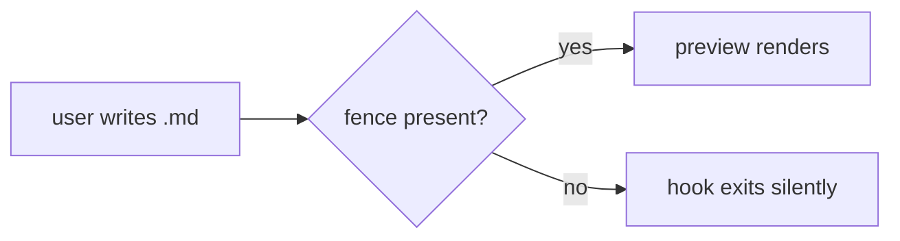

# Mermaid chart authoring

Apply these rules whenever producing Mermaid diagrams.

## When to use mermaid

- Prefer mermaid charts over ASCII art for any non-trivial diagram (flow, sequence, state, ER, class, gantt, etc.).
- Prefer proper markdown tables over ASCII tables.
- If a chart would be noisier than the underlying text, skip it.

## Validation (non-negotiable)

- Validate every mermaid block via the `mcp__mermaider__validate_syntax` MCP tool before writing it to any file or presenting it inline.
- The tool returns empty on success, or an error message on failure.
- If it returns errors, **fix and re-validate** — keep iterating until clean. Never write or present a chart that failed validation.
- If the tool is unavailable, say so explicitly rather than silently skipping validation.

## Fencing and file placement

- Always use proper fenced code blocks with the `mermaid` info string: ` ```mermaid `.
- The `mermaid-preview` hook (PostToolUse, on `Write|Edit|MultiEdit|NotebookEdit`) detects these fences in files with extensions `.md|.mmd|.mdx|.markdown|.ipynb` and renders a live browser preview.
- Never output mermaid charts inline in conversation only — also write them to a file so the preview hook triggers. For throwaway charts use a scratch path like `~/.claude/previews/scratch-*.md`.

## Preview behavior (what the user sees)

- Each source file gets a stable preview HTML keyed by a hash of its path (per-file, so multiple files can be previewed in parallel).
- On further edits the preview auto-reloads without losing scroll/zoom (it polls its own content hash).
- The preview is self-contained: the Mermaid bundle is inlined, no network required.
- Dark mode follows `prefers-color-scheme`.
- Hook logs land in `~/.claude/previews/preview.log`; LRU retention keeps the newest 20 previews.

## `securityLevel: 'loose'`

The preview initialises Mermaid with `securityLevel: 'loose'` so common label markup (`<br/>`, `<b>`, etc.) renders. This is safe because the pipeline is strictly local — the script tag is inlined from a vendored bundle, never fetched at runtime.

## Examples

### Canonical fenced block in a markdown file

````markdown

````

### Validation before writing

Call the MCP tool with the raw diagram body (no fence lines). Empty response = valid; any non-empty response is an error that must be fixed before writing.

```
mcp__mermaider__validate_syntax({
  "diagram_code": "flowchart LR\n  A --> B\n  B --> C"
})
```

Iterate: if the response lists an error, adjust the diagram and re-invoke until the response is empty.

### Scratch file for exploratory charts

If a chart is not destined for a durable document, still write it to a file so the preview hook fires:

```bash
scratch=~/.claude/previews/scratch-$(date -u +%Y%m%dT%H%M%S).md
printf '%s\n' '```mermaid' 'flowchart LR' '  A --> B' '```' > "$scratch"
```

## Scope and cross-references

- **Applies to**: Claude-authored Markdown destined for a file — READMEs, design notes, plans, docs.
- **Does not apply to**: pure chat-only diagrams (they never trigger the preview hook anyway — write them to a file via the scratch convention above instead).
- **Related artifacts**:
  - The enclosing `mermaid-preview` plugin — PostToolUse hook + vendored Mermaid bundle at `vendor/mermaid.min.js`.
  - `mcp__mermaider__validate_syntax` — the validator MCP tool used in the workflow above.
  - Preview output: `~/.claude/previews/preview-<slug>.html`; hook log: `~/.claude/previews/preview.log`.
